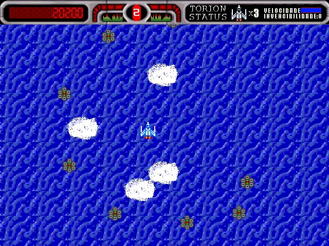



## Torion

### Description

Torion is a scrolling shoot game that was inspired in my favourite games, Zanac and Aleste from MSX. It was done using DirectX 7 w/ VB 6, and it´s great to learn Direct Draw, Direct Music, Direct Input and Direct Sound.
 
### More Info
 

             |
---                |---
**Submitted On**   |2001-04-28 19:34:28
**By**             |[Euler Vicente Lessa de Almeida](https://github.com/Planet-Source-Code/PSCIndex/blob/master/ByAuthor/euler-vicente-lessa-de-almeida.md)
**Level**          |Advanced
**User Rating**    |4.7 (14 globes from 3 users)
**Compatibility**  |VB 6\.0
**Category**       |[DirectX](https://github.com/Planet-Source-Code/PSCIndex/blob/master/ByCategory/directx__1-44.md)
**World**          |[Visual Basic](https://github.com/Planet-Source-Code/PSCIndex/blob/master/ByWorld/visual-basic.md)
**Archive File**   |[Torion190214302001\.zip](https://github.com/Planet-Source-Code/euler-vicente-lessa-de-almeida-torion__1-22809/archive/master.zip)

